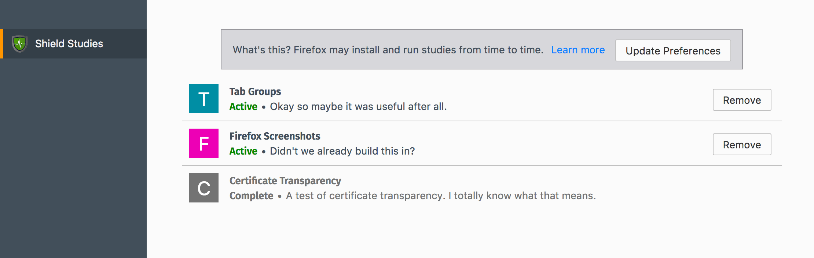

opt-out-study: Install a Study Add-on Without Prompting
=======================================================
The ``opt-out-study`` action installs an add-on, typically one that implements a
feature experiment by changing Firefox and measuring how it affects the user.

Each recipe corresponds to a single _study_; you could run multiple studies (
using multiple recipes) that use the same add-on.

Arguments
---------
Name
   User-facing name of the study, shown in ``about:studies``.
Description
   User-facing description of the study, shown in ``about:studies``.
Add-on
   The add-on to install. The list of available add-ons pulls from the add-ons
   that have been uploaded via the Extensions listing.
Pause Enrollment
   When checked, new participants will not be enrolled in the study, and
   existing participants will continue to run the study add-on. When unchecked,
   new participants will continue to be enrolled based on the recipe filters.

Uploading Add-ons
-----------------
Add-ons to be used in studies can be uploaded to Normandy via the extensions
listing, available at ``/control/extension/`` on the server.

Add-ons used in studies must be signed using a special key. Please contact the
Normandy development team for more details.

User Flow
---------
After the user matches the filter expression and executes the recipe:

1. If the user is eligible for the study, they are enrolled. A user is
   ineligible if:

   * Their Shield add-on is too old to support add-on studies.
   * Their `opt-out preference`_ is set to ``false``.
   * They have participated in this study/recipe previously.
   * They have an add-on installed with the same ID as the study add-on.

2. The add-on is downloaded and installed on their system, and study info is
   saved on the client.
3. Once it's done running the experiment, the study add-on should uninstall
   itself, which marks the study as complete.

about:studies
-------------

Users can view active and complete studies they've participated in on
``about:studies``. They can also manually end an active study using the Remove
buttons on this page.

The top of the page links to a SUMO article explaining studies, as well as to
the `opt-out preference`_.

.. _opt-out preference:

Opt-Out Preference
------------------
.. image:: opt_out_pref.png
   :align: center

Shield adds a preference to ``about:preferences`` under the Privacy & Security
tab, labeled "Allow Firefox to install and run studies" that defaults to being
checked and links to ``about:studies``. It controls the
``app.shield.optoutstudies.enabled`` preference in ``about:config``.

If unchecked, the user will not be enrolled in any new studies.

The checkbox is linked to the one above it: "Allow Nightly to automatically send
technical and interaction data to Mozilla". If that preference is unchecked, the
opt-out preference will also be unchecked and disabled until the user checks the
data one again (at which point the opt-out preference becomes checked once
more).

Ending a Study
--------------
The following events can cause a study to end before the add-on uninstalls
itself:

* The user uninstalls the add-on manually, or while Firefox is closed.
* The recipe for the study is disabled; the study will end the next time the
  user fetches recipes.

Testing Notes
-------------
- If testing against a local copy of Normandy with a self-signed certificate,
  add-on installation will fail unless you set the
  ``extensions.install.requireBuiltInCerts`` preference to ``false``.
