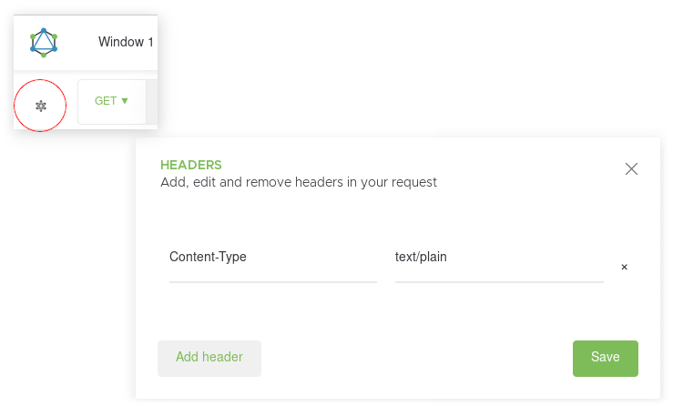

API
===
Normandy provides several APIs for reading and mutating data on the server.

RESTful API
-----------

Currently Normandy provides two versions of it's RESTful API.

The v1 API is a stable read-only API that is used by Normandy's recipe runner
to fetch recipes.

The v1 API can be accessed at ``/api/v1/``.

The v3 API is the current read-write API. Write abilities are only available
on VPN-protected instances. If you are writing a tool to communicate with
Normandy it is suggested that you use this API. Be aware that from time to
time breaking changes may be made to the shape of data returned.

The v3 API can be accessed at ``/api/v3/``.

Swagger
~~~~~~~

Each version of the API also exposes Swagger_ documentation. This can be
accessed at:

v1: ``/api/v1/swagger/``
v2: ``/api/v3/swagger/``

.. _Swagger: https://swagger.io/

GraphQL
-------

In addition to the RESTful API, Normandy also provides a GraphQL_ API. This
API should be considered experimental.

It can be accessed at ``/api/graphql/``.

.. _GraphQL: https://graphql.org/

Interacting with the GraphQL API
~~~~~~~~~~~~~~~~~~~~~~~~~~~~~~~~

To interact with the GraphQL API you will need some kind of client. You
may install one such as Altair_ as a browser extension.

The public GraphQL API only supports GET requests. Configure your client to
GET instead of POST.

Additionally, the server does not accept requests that set ``Content-Type:
application/json`` but do not provide a body. Altair does this by default. To
work around this in Altair, add a header (using the asterisk icon in the top
left of the UI), and specify ``Content-Type: text/plain``.

.. _Altair: https://altair.sirmuel.design/
